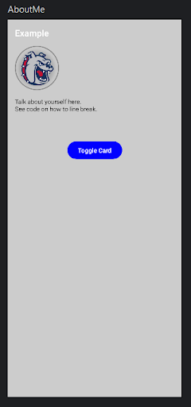

# Workshop

[Requirements](WorkshopRequirements.pdf)

# Instructions

[PDF Form](WorkshopInstructions.pdf)

## 1. Project Structure


### Step 1
Make sure Project View is open using the drop-down menu: `View >> Tool >> Windows >> Project` or `Alt+1` shortcut on Windows.


### Step 2
Make sure you are using Android format in Project View by using the drop-down
menu: Android


### Step 3
Expand folders to view MainActivity.kt by expanding the “app” folder and then
expanding the “com.example.workshop” package.


## 2. Review `MainActivity.kt`


### Step 1
Open the MainActivity.kt file from the Project View

### Step 2
Identify the different Functions listed below;

The `onCreate` function is like the main function in C or Java, it defines the main entry point of the program. There are also variations like `onResume` that are used in different situations.

The `AboutMe` function structures the code to be scrollable and to fill out the screen. It also has the other Composables in the order we need. You don’t need to edit this function.

The `Title` function is the name of your profile. We will use your name with your customized text.

The `ProfilePic` function will be used to share a picture of yourself. We will explore adding resources to the project and connecting them to your code.

The `SelfDescription` function will be used to talk about yourself. We will explore text style and `Modifiers` to customize your text.

The `YourButton` function is a customized button users can click. We will only modify the button itself and not the other content around it. The button has an “onClick” that will do something when we program it.

The `YourCard` function is filled with content that needs to be rendered. We will edit the content and use buttons to open and close the card. We only modify the text and button in the card to your style.

### Step 3
Make sure the split view is selected to see the preview.


### Step 4
Make sure your code compiles and you can view the preview. If you don’t see the preview, follow the prompt in the middle of the preview window.



### 3. Edit Profile Title


### Step 1
In the Title function replace the “Example” text with your name.

### Step 2
Change the color to your favorite color.

### Step 3
Change the font size so your name fills the width of the screen.

### Step 4
Change the font size so your name fills half the width of the screen.

### Step 5
Remove the // commit and set your text to the center of the screen.

## 4. Edit Profile Description


### Step 1
In the `SelfDescription` function replace the Text string with a description about
yourself.

### Step 2
Select the `TextStyle` function and then hover over it. This should bring up a list of the function parameters.

### Step 3
Set the text color to something you like.

### Step 4
Set the background color to work with your text color.

### Step 5
Set the text font size to be readable.

### Step 6
Change the font weight to be Italic

### Step 7
Set the font alignment

### Challenge
Change the font direction.

## 5. Edit Profile Image

### Step 1
Make sure the Resource Manager is open by using the drop-down menu: `View >> Tool
Windows >> Resource Manager`


### Setp 2
Download a photo of yourself. If you don’t want to use your picture, download an animal that looks like you. 

### Step 3
Add your photo the the project by using, in the Resource Manager, the `+` button drop-down menu: `+ >> Import Drawables`. Find your picture in your file system, select it, and hit `OK`.

### Step 4
Replace `id` of the `paintedResource` with your the id of your photo resource. Right-click and copy the id from the Resource Manager or drag the icon from the Resource Manager into your code.

### Step 5
Set the content scale for the image to fit. Select and hover over the Image function to get the parameter name you need. 

## 6. Emulate!

### Step 1
Make sure the Device Manager is open by using the drop-down menu: `View >> Tool
Windows >> Device Manager`

### Step 2
Launch your device with the play button.

### Step 3
Wait for the device to launch.

### Step 4
Build your project using the drop-down menu: `Build >> Make Project` or the `Ctrl+F9` shortcut on Windows.

### Step 5
Run your application on the device by using the drop-down menu: `Run >> Run ‘app’`.
`Shift+F10` shortcut on Windows.

## 7. Edit Profile Card

### Step 1
Change the card's text parameter to “Button Card”.

### Step 2
Remove the Text function that holds the Card Content. We will replace it with our
new content.

### Step 3
Add a `Row` function to replace the content.

You can import the Row function by selecting and hovering over Row and clicking import on the menu that pops up.

### Step 5 
Add 3 buttons to the Row content as shown:
```
Row {
    Button(
        onClick = {}
    ) {
        Text("Left")
    }
    Button(
        onClick = {}
    ) {
        Text("Middle")
    }
    Button(
        onClick = {}
    ) {
        Text("Right")
    }
}
```

### Step 6
Emulate your new buttons by using the drop-down menu: `Run >> Run ‘app’`

Notice this time the menu option icon has changed. This will stop your application and
rebuild it then start it with the new updates.

Also, Notice the buttons that you added do nothing. Verify they are displayed.

### Step 7
Add context reference to the Row content. Copy the line of code as shown. Import
the `LocalContext` property.

### Step 8
Add a toast to your buttons. Use the line of code shown.

Add the Toast to the empty `onClick` body for each button. Rename the text to the actual button name.

```
Button(
    onClick = { Toast.makeText(context, "Left", Toast.LENGTH_SHORT).show() }
) {
    Text("Middle")
}
```

### Step 9
Run your app and test your button.

### Challenge
Add `onClick` actions to everything you can and make it do something. Use the `Modifier` object as shown to add a clickable action to a text. Try using a click action to change your profile name.

Change the background color.

Change your profile description.
